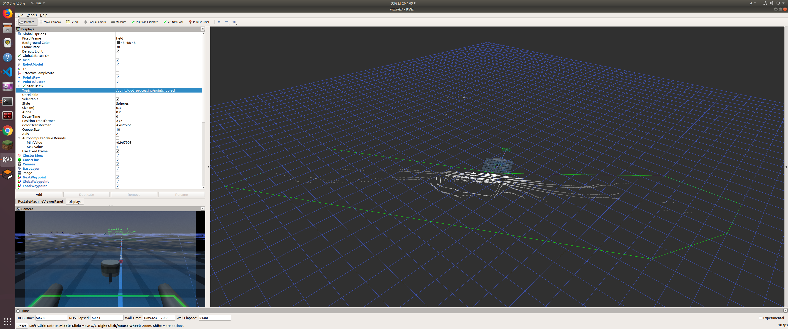

# Crop Hull Filter

| *master* | *develop* |
|----------|-----------|
|||

nodelet which removes/remains pointcloud in the Crop Hull.

PointClouds inside the green convex hull was removed by crop_hull filter.

Param

| *Param* | *Type* | *Description* |
| --- | ---| --- |
| frame_id | String | frame_id of the points |
| points/point*/x | Double | x axis value of the *th point |
| points/point*/y | Double | y axis value of the *th point |
| crop_outside | Bool | IF this parameter set True, the filter remains the pointcloud outside of the Convex Hull |
| marker_line_width | Double | line width of the line marker |
| marker_color_r | Double | R value of the marker color (rgba color space) |
| marker_color_g | Double | G value of the marker color (rgba color space) |
| marker_color_b | Double | B value of the marker color (rgba color space) |
| marker_color_a | Double | A value of the marker color (rgba color space) |

Topic

| *Topic* | *Type* | *Pub/Sub* | *Description* |
| --- | ---| --- | --- |
| input | sensor_msgs/PointCloud2 | Sub | Subscribed Point Cloud |
| output | sensor_msgs/PointCloud2 | Pub | Filtered Point Cloud |